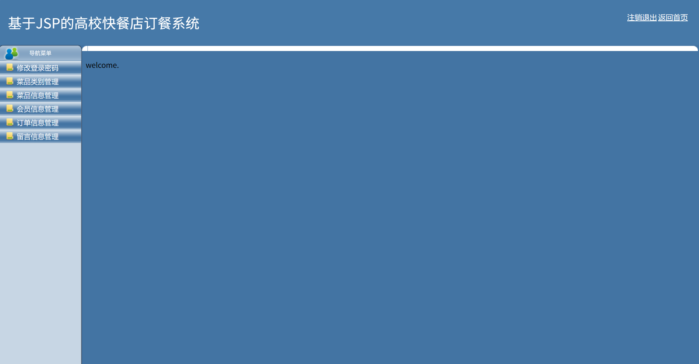
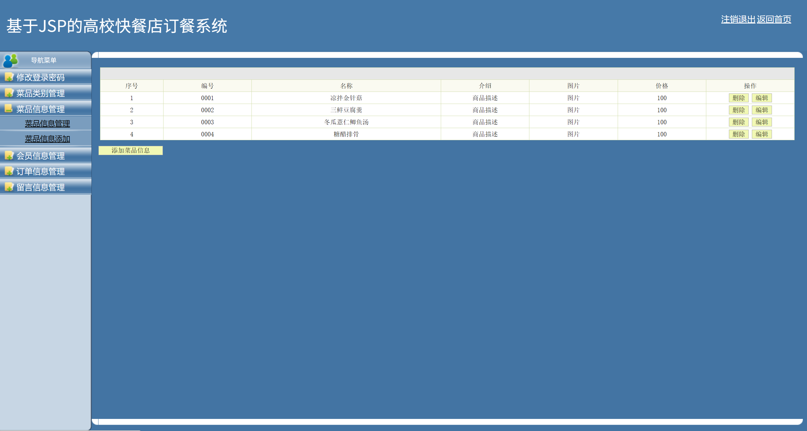

# jspServlet021
jspServlet021点餐订餐系统+BG
 
## 源码问题查看主页咨询

### 一、关键词

点餐订餐系统，点餐管理系统

### 二、作品包含
源码+数据库+设计报告文档+PPT+全套环境和工具资源+本地部署教程

### 三、项目技术
前端技术：Html、Css、Js、Jquery、Bootstrap
后端技术：Java、JSP、Servlet、JDBC

### 四、运行环境（以下版本亲测，其他版本兼容性请自行测试）
开发工具：IDEA/eclipse

数据库：MySQL5.7或8.0

服务器：Tomcat8.5或Tomcat9.0

数据库管理工具：Navicat10以上版本

环境配置软件： JDK1.8

浏览器：谷歌浏览器

### 五、项目介绍
项目编号：jspServlet021

网上订餐系统开发的过程中使用的开发平台是当今比较流行的平台MyEclipse，使用的服务器也是人们普遍使用的Tomcat服务器，主要编程语言采用的是jsp语言和java语言，在设计开发网上订餐系统的同时，充分考虑了系统的可扩展性和兼容性，可维护性，所开发出的网上订餐系统可以满足人们对于日常订餐的需要.

系统主要分为前台和后台两大模块
  1：对于用户模块:
      1.1 用户可以进行网上点餐
	  1.2 或是注册成为会员。
  2：对于系统管理员
	  2.1 网上订餐系统的后台管理人员可以进行对已经买单的用户进行信用的评价
	  2.2 对交易完成后的订单进行操作和查看。例如增加或删除或编辑等；
	  2.3 还可以对菜品信息管理，例如增加或删除或编辑等。
	  2.4 还可以对用户信息管理，例如增加或编辑或删除用户的信息；
	  2.5 还可以对菜品类别管理，例如增加或编辑或删除菜品类别的信息，
	在对上述总体的系统功能模块进行分析之后，我们进行进一步的细化，细化用户点餐功能。
		   3.1 菜品查询
		   3.2 查看购物车
		   3.3 查看订单
		   3.4 进行留言

### 六、运行截图

